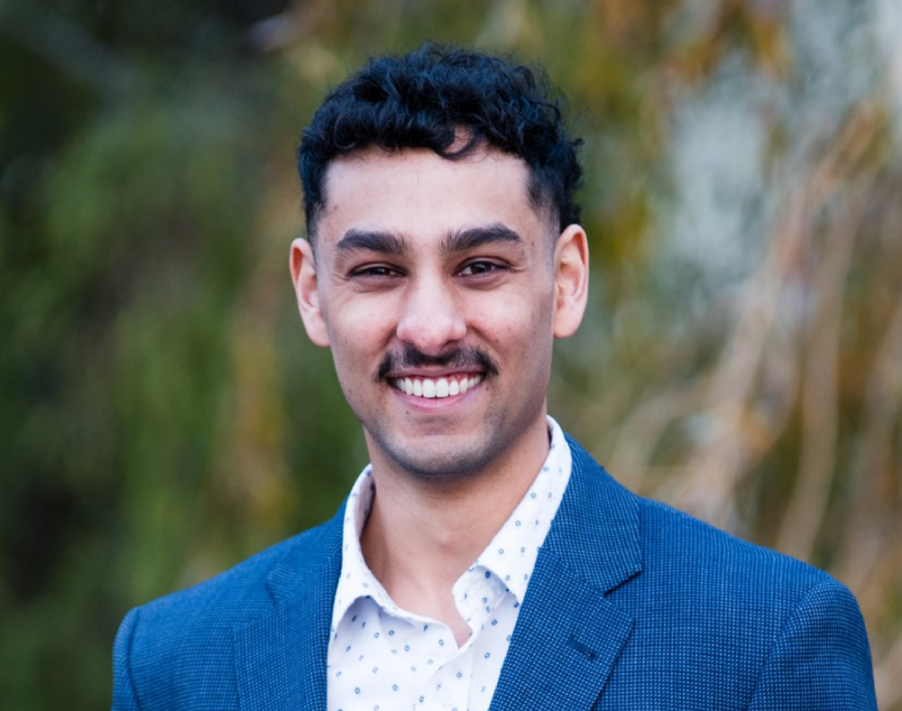

# About me

Hey there, and thanks for visiting my page!

I am a PhD student at Brown University. I will be researching multi-agent reinforcement learning and its application to swarm robotics with [Amy Greenwald](http://glamor.cs.brown.edu/) and [Nora Ayanian](https://viterbi-web.usc.edu/~ayanian/). 

Previously, I was an AI engineer at [Faethm.ai](https://faethm.ai/) where I researched the impact of AI and emerging technologies on jobs. In particular, I modeled job transition in the hope of finding good jobs for people who are at risk of automation. I also worked extensively on extracting skills from millions of job ads using advanced NLP techniques to model the demand side of skill trends. 

I graduated from the University of Sydney with a double degree in Computer Science (Hons I) and Business Analytics in 2019. 

# My Links
## Reinforcement Learning
In my free time I work on multi-agent reinforcement learning. I am a third party contributor to [Petting Zoo](https://www.pettingzoo.ml/third_party_envs). My repo, [pz-dilemma](https://github.com/arjun-prakash/pz_dilemma), adds a collection of game theory environments. 

__[Cycling, Centipedes and MARL](https://medium.com/@arjunprakash_18193/cycling-centipedes-and-multi-agent-reinforcement-learning-5cf3c5d9ebd7)__: A project examining the centipede game when played by RL agents. 

## Papers
__[Clustering volatility regimes for dynamic trading strategies](https://arxiv.org//abs/2004.09963)__
__with Gilad Francis, Nick James and [Max Menzies](https://maxmenzies.com):__ 

We develop a new method to find the number of volatility regimes in a non-stationary financial time series. We create and validate a dynamic portfolio allocation strategy that learns the optimal match between the current distribution of a time series with its past regimes, thereby making online risk-avoidance decisions in the present.

__[On the Fairness of 'Fake' Data in Legal AI](https://arxiv.org/abs/2009.04640)__
__with Lauren Boswell:__

The economics of smaller budgets and larger case numbers necessitates the use of AI in legal proceedings. We examine the concept of disparate impact and how biases in the training data lead to the search for fairer AI. This paper seeks to begin the discourse on what such an implementation would actually look like with a criticism of pre-processing methods in a legal context . We outline how pre-processing is used to correct biased data and then examine the legal implications of effectively changing cases in order to achieve a fairer outcome including the black box problem and the slow encroachment on legal precedent. Finally we present recommendations on how to avoid the pitfalls of pre-processed data with methods that either modify the classifier or correct the output in the final step. 
## Projects

__[Mitsubishi Electric](https://www.asianz.org.nz/business/intern-optimizes-life-and-algorithms-in-tokyo/):__ I spent 3 months in Japan (for the first time), working in the Advanced Machine Learning Division thanks to the Asia New Zealand Foundation. 

__[Stan Droid](https://bitbucket.org/a-prakash/publicstan/src/master/):__ A customer service chatbot for students and admin staff of St Andrew's College with continuous integration and unit testing. 90% uptake and over 100 thousand messages per year.

__[Scopus Miner](https://bitbucket.org/hamishivi/scopusminer/src/master/) with Hamish Ivison, Andrew Campbell and Boris Leung:__ A tool to extract high quality data from a corpus of abstracts from academic literature, and present the data in a visual and interpretable format. These visualisations may be transferred to other domains of textual information, providing intuitive methods to gain new insight and explore various text-based datasets. 

__[DenserFlow](https://github.com/hamishivi/DenserFlow) with Hamish Ivison:__ Our implementation of base TensorFlow layers
